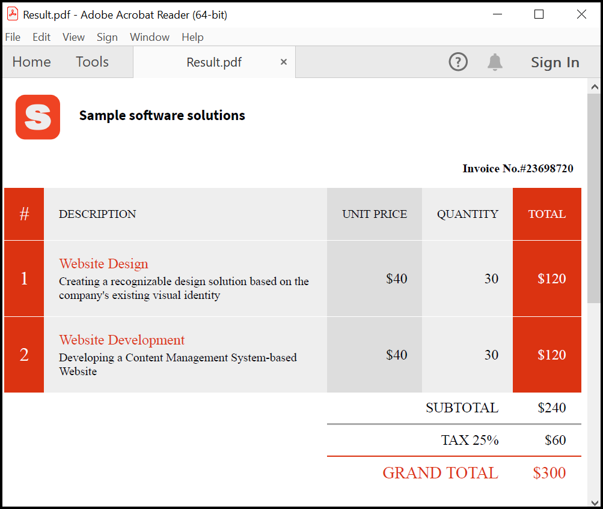

# Generate PDF documents from dynamic HTML using Syncfusion PDF generator API 

This repository explains how to generate PDF documents from dynamic HTML using Syncfusion PDF genrator API. Design your document with simple HTML and CSS, and then call our API to generate the PDF document. 

## Syncfusion PDF generator API 

The Syncfusion PDF generator API allows the users to create a completely new PDF documents from dynamic HTML files easily and quickly. Our API supports all the HTML files structured with all available customization options. 

## Steps to create HTML invoice and conveter to a PDF document using WebAPI
1. Create HTML template 
2. CSS Styling 
3. Use Syncfusion Web API Calls 
4. Add HTML File
5. Add Additional Assets (ie., fonts, images, etc)
6. Run the server and calling the API from Client 

### Create an HTML Template 

An HTML template contains placeholders with {{mustache}} syntax. It is used to bind the actual data to the HTML template. For this example, we'll use the [Scriban scripting language](https://github.com/scriban/scriban) to create the placeholders. It's a lightweight scripting language and engine for .NET. The below HTML template (index.html) has been designed by adding the invoice number, company details and some additional datas with inline CSS for styling. 

**index.html**
```html

<html lang="en">
  <head>
    <meta charset="utf-8">
    <title>Invoice</title>
    <link rel="stylesheet" href="style.css" media="all" />
  </head>
  <body>
      <div class="grid-container">
          <div>
              
          </div>
          <div style="margin-left:30px; margin-top:20px"><b>{{company_details.name}}</b></div>
      </div>
      <div style="text-align:right;margin-right:10px; margin-top:15px"><b>Invoice No.#23698720</b></div>
      <br />
      <main>
          <table border="0" cellspacing="0" cellpadding="0">
              <thead>
                  <tr>
                      <th class="no">#</th>
                      <th class="desc">DESCRIPTION</th>
                      <th class="unit">UNIT PRICE</th>
                      <th class="qty">QUANTITY</th>
                      <th class="total">TOTAL</th>
                  </tr>
              </thead>
              <tbody id="invoiceItems">
                  {{- index = 1 -}}
                  {{ for item in items }}
                  <tr>
                      <td class="no">{{index}}</td>
                      <td class="desc"><h3>{{item.name}}</h3>{{item.description}}</td>
                      <td class="unit">${{item.price}}</td>
                      <td class="qty">{{item.quantity}}</td>
                      <td class="total">${{item.total_price}}</td>
                  </tr>
                  {{index = index + 1}}
                  {{end}}
              </tbody>
              <tfoot>
                  <tr>
                      <td colspan="2"></td>
                      <td colspan="2">SUBTOTAL</td>
                      <td>${{sub_total}}</td>
                  </tr>
                  <tr>
                      <td colspan="2"></td>
                      <td colspan="2">TAX 25%</td>
                      <td>${{tax}}</td>
                  </tr>
                  <tr>
                      <td colspan="2"></td>
                      <td colspan="2">GRAND TOTAL</td>
                      <td>${{grand_total}}</td>
                  </tr>
              </tfoot>
          </table>
      </main>
  </body>
</html>

```

### CSS Styling 

The Cascading Style Sheets (CSS) is a style sheet language used for describing the presentation of a HTML document. In this case, we have marked the heading as bold, add text with custom font, add logo and styling the table. 

**style.css**
```css

@font-face {
  font-family: SourceSansPro;
  src: url(SourceSansPro-Regular.ttf);
}
.grid-container {
    display: grid;
    grid-template-columns: 60px auto;
    padding: 10px;
    font-size: 1.2em;
    font-weight: normal;
    text-align: left;
}
table {
  width: 100%;
  border-collapse: collapse;
  border-spacing: 0;
  margin-bottom: 20px;
}
table th,
table td {
  padding: 20px;
  background: #EEEEEE;
  text-align: center;
  border-bottom: 1px solid #FFFFFF;
}
table th {
  white-space: nowrap;        
  font-weight: normal;
}
table td {
  text-align: right;
}
table td h3{
  color: #db3311;
  font-size: 1.2em;
  font-weight: normal;
  margin: 0 0 0.2em 0;
}
table .no {
  color: #FFFFFF;
  font-size: 1.6em;
  background: #db3311;
}
table .desc {
  text-align: left;
}
table .unit {
  background: #DDDDDD;
}
table .qty {
}
table .total {
  background: #db3311;
  color: #FFFFFF;
}
table td.unit,
table td.qty,
table td.total {
  font-size: 1.2em;
}
table tbody tr:last-child td {
  border: none;
}
table tfoot td {
  padding: 10px 20px;
  background: #FFFFFF;
  border-bottom: none;
  font-size: 1.2em;
  white-space: nowrap; 
  border-top: 1px solid #AAAAAA; 
}
table tfoot tr:first-child td {
  border-top: none; 
}
table tfoot tr:last-child td {
  color: #db3311;
  font-size: 1.4em;
  border-top: 1px solid #db3311; 
}
table tfoot tr td:first-child {
  border: none;
}

``` 

The following screenshot shows the output of the HTML template with styled CSS.


### Use PDF generator Web API Calls 
The [Minimal API with ASP.NET Core project](https://learn.microsoft.com/en-us/aspnet/core/tutorials/min-web-api?view=aspnetcore-7.0&tabs=visual-studio) is used to create PDF generation API. In this application, we have convert the given HTML and assets (JSON, image,font, etc) to text using ``StreamReader `` class based on the client request and convert it to HTML to PDF document. Please refer the below code example for more details,

```csharp

var html = await context.Request.ReadFormAsync();
var value = html.AsQueryable().ToList().Where(x => x.Key == "application/json").FirstOrDefault().Value.ToString();
var options = JsonConvert.DeserializeObject<ConversionOptions>(value);

string htmlText = "";
string jsonData = "";
if (options != null)
{
  htmlText = ReadText(html.Files[options.Index].OpenReadStream());
  jsonData = ReadText(html.Files[options.Data].OpenReadStream());
  CopyAssets(options.Assets, html.Files);
}

String path = Path.GetFullPath("template/");
var conversion = new HtmlToPdfConversion();
var pdf = conversion.ConvertToPDF(htmlText, path, jsonData, options);
context.Response.ContentType = "application/pdf";
await context.Response.Body.WriteAsync(pdf);

```


### Call Web API from C# console application 
The [.NET Console application](https://learn.microsoft.com/en-us/dotnet/core/tutorials/with-visual-studio?pivots=dotnet-7-0) is used to create client application. In this application, we have used **RestClient** to sets the server IP address from the [RestSharp](https://www.nuget.org/packages/RestSharp) NuGet package. 

```csharp
var client = new RestClient("https://localhost:7094/pdf"); 
```

#### Add HTML file and additional assets 
We need to include the HTML and CSS file in the **RestRequest** and send as many additional assets (ie., fonts, images, PDF size, etc) with the request in the ``assets`` key of the HTML. 
``Assets passed in the request must match the name used to reference in the file.``

```csharp

var request = new RestRequest().AddFile("index.html", "Template/index.html")
 .AddFile("style.css", "Template/style.css").AddFile("data.json", "Template/InvoiceData.json").AddFile("logo.png", "/logo.png").AddFile("SourceSansPro-Regular.ttf", "Template/SourceSansPro-Regular.ttf");
request.Method = Method.Post; 
var json = new JsonObject
{
    ["index"] = "index.html",
    ["data"] = "data.json",
    ["width"] = 595,
    ["height"] = 842,
    ["margin"] = 0,
    ["assets"] = new JsonArray
 {
 "style.css",
 "SourceSansPro-Regular.ttf",
 "logo.png"
 }
}; 
request.AddParameter("application/json", json.ToString(), ParameterType.RequestBody); 
var response = await client.ExecuteAsync(request);
if (response.StatusCode == System.Net.HttpStatusCode.OK)
{
    System.IO.File.WriteAllBytes("Result.pdf", response.RawBytes);
    
}

``` 

### Steps to run the server and calling the API from Client 

Step 1: Download both the server and client application. 

Step 2: Open the solution files of both projects using Visual Studio. 

Step 3: Rebuild the solution to install the required NuGet package. 

Step 4: First run the server application (PDF_from_HTML_API) and then the published website will open in the browser. 


Step 5: Now copy the localhost path (https://localhost:7094/pdf) and add it in RestClient class of client application (HTML_to_PDF_Console). This will creates the PDF document (Result.pdf) in the **bin/Debug/net7.0/** folder. 

Screenshot of the generated invoice PDF document:


## Sample Templates 

Template Name | HTML Template | Description 
--- | --- | ---
[Invoice](https://github.com/SowmiyaLoganathan/Generate-PDF-from-HTML/tree/main/Templates/Invoice) |  | An invoice is a commercial document issued by a seller to a buyer relating to a sale transaction and indicating the products, quantities, and agreed-upon prices for products or services the seller had provided the buyer. 
[BoardingPass](https://github.com/SowmiyaLoganathan/Generate-PDF-from-HTML/tree/main/Templates/BoardingPass) |  | A boarding pass is a document provided by an airline during check-in, giving a passenger permission to board the airplane for a particular flight.
[Lease Agreement](https://github.com/SowmiyaLoganathan/Generate-PDF-from-HTML/tree/main/Templates/LeaseAgreement) |  | A rental agreement is a contract of rental, usually written, between the owner of a property and a renter who desires to have temporary possession of the property.
[EmployeeCertificate](https://github.com/SowmiyaLoganathan/Generate-PDF-from-HTML/tree/main/Templates/Certificate) |   | This project is an example of generating employee appreciation certificate. This certificate is one of the way to say thank you to the employees who work in their organization.
